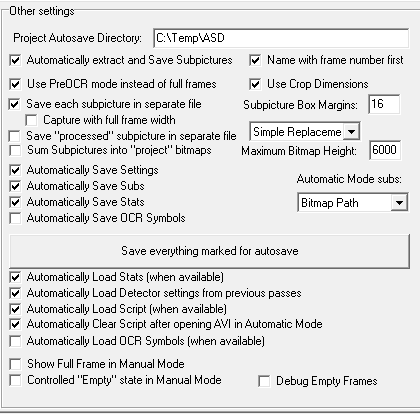

# py3avi2bdnxml

py3avi2bdnxml.py converts the imageTimings.srt produced by AVISubDetector to a valid BDN XML file that can be read by BDSup2Sub++. It is meant to be part of a larger workflow to convert hardsubs to softsubs as BD PGS (.sup) files for placement into Matroska (.mkv) containers.

## Key Features:

- Works.
- Produces a standard BDNXML_output.xml file can be read by applications like BDSup2Sub++.
- Supports 23.976 and 24 fps modes. 
- Supports multiple resolutions (480p, 720p, 1080p both 16:9 and 4:3 variants).
- Automatically removes quirks from SRT AVISubDetector file.
- Supports Romaji mode.
- Supports Kanji mode (experimental).
- Supports limited merging of discrete AVISubDetector SRT files.

## Workflow Features:

- Provides a non-OCR way to include subs.
- Ideal for subs foriegn to one's native language.
- Ideal for difficult to OCR fonts and non-Latin scripts (Chinese, Arabic, Devanagari, Cyrillic).
- Automatic generates timing information from hardsubs (SRT/SSA).

## Planned Features:

- Future: Supports quirky SRT to "standard SRT" conversions.
- Future: Additional fps modes.

## Hardsubs.AVI -> BD PGS image-based softsubs Workflow:

1. First, due to BD PGS limitations, make sure source video is in 480p, 720p, or 1080p.
    Hint: Use AVIsynth's addBorders() and spline64resize()
2. Load .avi or .avs file with AVISubDetector (use 32-bit avisynth or avi2fs)
3. Use the following settings for AVISubDetector: 
    
4. press "Start" and wait a while.
5. When done, close AVISubDetector.
6. Process the resulting .SRT into py3avi2bdnxml using the appropriate settings.
6. Move the resulting XML to the SubPic\ directory created by AVISubDetector
7. Open "SubPic\output.xml" using [bdsup2sub++](http://www.videohelp.com/software/BDSup2Sub).
8. Extend/delete/upscale/shift and otherwise modify subs as necessary.
9. Export to SUP(BD) format (Settings: Set Palette as "create new" filtered w/Lanczos3).
10. Play target video matching the resolution specified with MPC to view the result.
    File->Subtitles->Load Subtitles or Ctrl+L or drag and drop output.sup onto video to test.
12. Mux video.avi and output.sup together using mkvtoolsnix.
    Optional: specify a delay timing for syncing purposes.

## Workflow Tips and Limitations:

- AVISubDetector:
    - can load mp4/mkv files by using AVISynth.
    - needs to be restarted after each operation.
    - messes up the .srt if it can read the settings from the previous operation.
    - subtitle detection accuracy can be improved by minimizing the detection height using Settings->"Crop Top."
    - works best using the main settings specified above and otherwise at the defaults.
    - has additional a guide [here] and usage tips from the creator [here].
    - can do romaji, or subtitles on top, by using AVISynth's FlipVertical().
    - can do kanji, or subtitles on either side, by using AVISynth's TurnLeft() and TurnRight() filters.
        - For kanji on the left, use TurnLeft() to place them on the bottom of the video.
        - For kanji on the right, use TurnRight.
- After AVISubDetector finishes processing is the best time to quality check the SubPic\ folder.
    - Delete any pictures that do not have subtitles in them.
    - Center subtitles that are off-centered via cropping.
- After AVISubDetector finishes processing is the best time to quality check the SRT in the Text\ folder.
    - For entries with multiple entries, decide which of the entries should take precedence.
    - It is reccomended to delete the extra(s).
    - py3avi2bdnxml's default setting is to select which one should take prededence (first or last) based on the -pl switch.
- For py3avi2bdnxml:
    - py3avi2bdnxml does not handle video at frame rates other than 24 and 24000/1001 very well currently. Please double-check the source and target video frame rates.
    - .sup files specifying an image with a height above or below the maximum resolution for that quality settings may cause strange behavior.
       - For this reason, py3avi2bdnxml soft-enforces a 2 pixel border. If this is not enough, change to a 4+ pixel border using -yo and -xo.
    - When doing romaji, or kanji, it is possible to flip the images back prior to usage in BDSup2Sub++, by using py3avi2bdnxml's -ip switch.
        - Example: py3avi2bdnxml input.srt -ro -ip
        - Example: py3avi2bdnxml input.srt -ko -ip
- BDSup2Sub++:
    - does not handle very large quantities of small images in arbitrary resolutions very well. Consider deleting the false positives found from SubPic\ prior to creating the BDN.XML file.
    - has the following recommended settings: Palatte: Create New, Filter: Lanczos3.
    - has a batch setting to modify the placement of every subtitle entry: Edit-> Move all Captions.
    - has additional documentation [here].
- Neither AVISubDetector nor BDSup2Sub++ are fully stable and may crash on occasion.
- .sup players do not always support displaying multiple pictures simultaneously (e.g. HPC-MC).
    - It is recommended to only merge discrtete SRT files if the timing do not overlap.

## Example Usage Settings:

Note: [ ] means optional.

Syntax: py3avi2bdnxml.py input.srt
    [-h] [-q QUALITY] [-xo XOFFSET] [-yo YOFFSET]
    [-fps FRAMESPERSECOND] [-e SRTENCODING] [-ok] [-or]
    [-kf KANJIFILE] [-rf ROMAJIFILE] [-kr] [-ip] [-pl]
    [-d] [-o OUTPUT]

CorrectUsage: 
```
py3avi2bdnxml input.srt 
py3avi2bdnxml input.srt -o output.xml
py3avi2bdnxml input.srt -o output.xml -q 480p 
py3avi2bdnxml input.srt -o output.xml -ro -ip
py3avi2bdnxml input.srt -o output.xml -ko -ip
```

Optional Argument | Description
--- | ---
-h, --help        |    show this help message and exit
-q QUALITY, --quality QUALITY | specify quality 480p/720p/1080p, default=720p
-xo XOFFSET, --xOffset XOFFSET| specify how far kanji should be from left and right, >=2 and <=video.width, default=2
-yo YOFFSET, --yOffset YOFFSET| specify how far dialogue and romaji should be from bottom and top, >=2 and <=video.height, default=2
-fps FRAMESPERSECOND, --framesPerSecond FRAMESPERSECOND | specify conversion rate from SRT to BDN XML timecodes, default is 24000/1001
-e SRTENCODING, --srtEncoding SRTENCODING | specify encoding for input files, default=utf-8
-ok, --onlyKanji      | specify the only input file represents a line of vertical Kanji input
-or, --onlyRomaji    | specify the only input file represents Romaji input
-kf KANJIFILE, --kanjiFile KANJIFILE | specify an additional Kanji input file
-rf ROMAJIFILE, --romajiFile ROMAJIFILE | specify an additional Romaji input file
-kr, --kanjiRight    | alignment for Kanji should be on the Right ,default=Left
-ip, --enableImageProcessing | vertically flip romaji images and rotate kanji ones clockwise, or counterclockwise
-pl, --preferLast    | when resolving duplicate file entries for a subtitle, prefer the last one list, default=First
-d, --debug          | display calculated settings and other miscellaneous information
-o OUTPUT, --output OUTPUT | specify the output file name, default is to change to .xml


- Quality Options: 480p, 480p_43, 720p, 720p_43, 1080p, 1080p_43, (720p)
- FPS Options: 24, 24000/1001, (24000/1001)
    - Note: Other FPS modes will process without error but are considered highly experimental.
- XOffset: 2-4 recommended, Minimum: 2, Default: 2
- YOffset: 2-4 recommended, Minimum: 2, Default: 2

## Download and Install Guide:

```
Latest Version: 0.2-alpha
In Development: 0.2-beta Open an issue for bugs, feature or compile requests if something needs updating.
```
1. Click [here](//github.com/gdiaz384/py3avi2bdnxml/releases) or on "releases" at the top to download the latest version.
2. Extract py3avi2bdnxml.exe from the archive of your OS/architecture.
3. Place py3avi2bdnxml.exe in your environmental path.
    To find places to put it: cmd.exe -> echo %path%
4. (optional) Rename to something more memorable.
6. For usage, refer to the  **Workflow Example** and **Example Usage Guide**  sections.

## Dependencies and Compile(exe) Guide

- If downloading directly from github instead of using a release.zip, remember to change the line ending back to Windows before attempting to use it by using Notepad++ (if applicable).
- Remember to change the line ending back to not-broken-because-of-github if downloading from github directly using [Notepad++](//notepad-plus-plus.org/download) before attempting to compile. 
- Pyinstaller compatible character encodings for .py files are ANSI and UTF-8 w/o BOM.
 
- [Python 3.2-3.4](//www.python.org/downloads)  #remember to add to %path%
- [pysrt](//github.com/byroot/pysrt) by byroot    #srt library dependency
- [Pillow image library](//python-pillow.org)    #image library dependency
- [lxml](//pypi.python.org/pypi/lxml), Windows: [lxml-3.2.5.win-amd64-py3.4.exe](//pypi.python.org/pypi/lxml/3.2.5)  #xml parsing dependency
- [pyinstaller](http://www.pyinstaller.org)     #repackager

```
>python --version   #requires 3.2-3.4
>pip install pysrt
>pip uninstall PIL   #uninstall python image library if installed
>pip install Pillow
>For Windows, download and install from the hosted binaries (link above). Otherwise:
>pip install lxml
>py3avi2bdnxml.py --help   #makes sure all dependences are present
>pip install pyinstaller
>pyinstaller --version  #makes sure it installed
>pyinstaller --onefile py3avi2bdnxml.py  #Look for the output under the "dist" folder.
```

## License:

- Script (.py): Pick your License (any), Examples: GPL (any) or BSD (any) or MIT/Apache.
- Binaries (.exe): GPL 3.0
- Also: The binaries in workflow.zip each have their own licenses.
